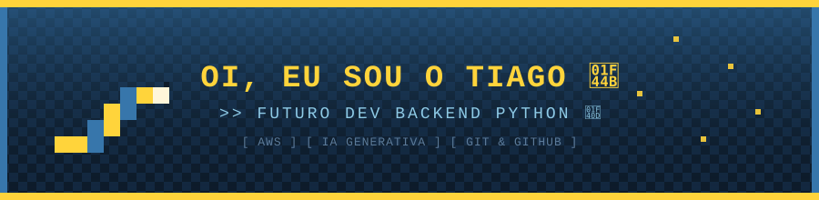

<!-- ===================== BANNER PRINCIPAL ===================== -->

<!-- ===================== TYPING ANIMATION ===================== -->

 

<!-- ===================== SOBRE MIM ===================== -->
## 🐍 Sobre mim

- 🎓 Estudante de **Gestão de Tecnologia da Informação**
- ⚓ Atualmente na **Marinha do Brasil**
- 💻 Estudando **Python** e desenvolvimento **Backend**
- ☁️ Explorando **AWS** e me aventurando em **IA Generativa**
- 🎯 Em busca da minha **primeira oportunidade como programador**
- 📍 Natal, RN - Brasil
- ⚡ Fun fact: cada linha de código é um passo mais perto do objetivo!

 

---

<!-- ===================== TECH STACK ===================== -->
## 🛠️ Minhas tecnologias

  

---

<!-- ===================== PROJETOS ===================== -->
## 🚀 Meu projeto em destaque

<table>
<tr>
<td width="100%" align="center">

### 🐍 Python - Curso em Vídeo

Exercícios e desafios resolvidos durante o curso de Python 3 do Gustavo Guanabara, praticando lógica de programação do zero. 💡

`Python`

[🔗 Ver repositório](https://github.com/Oliver085/Python-CursoEmVideo)

</td>
</tr>
</table>

---

<!-- ===================== OBJETIVOS ===================== -->
## 🎯 Meus objetivos atuais

- 🐍 Praticar mais lógica de programação em Python todo dia
- 🌱 Fazer commits com frequência no GitHub
- ☁️ Aprender AWS na prática, com projetos reais
- 🤖 Explorar IA Generativa aplicada ao Backend
- 💼 Conquistar minha primeira oportunidade como programador

---

<!-- ===================== GITHUB STATS ===================== -->
## 📊 Minhas estatísticas

---

<!-- ===================== TROPHIES ===================== -->
## 🏆 Conquistas

---

<!-- ===================== SNAKE ANIMATION ===================== -->
## 🐍 Minhas contribuições (modo cobrinha!)

---

<!-- ===================== REDES SOCIAIS ===================== -->
## 🌐 Vamos nos conectar!

---

<!-- ===================== RODAPÉ ===================== -->

💛💙 Obrigado por visitar meu perfil! Bons códigos! 🐍✨

